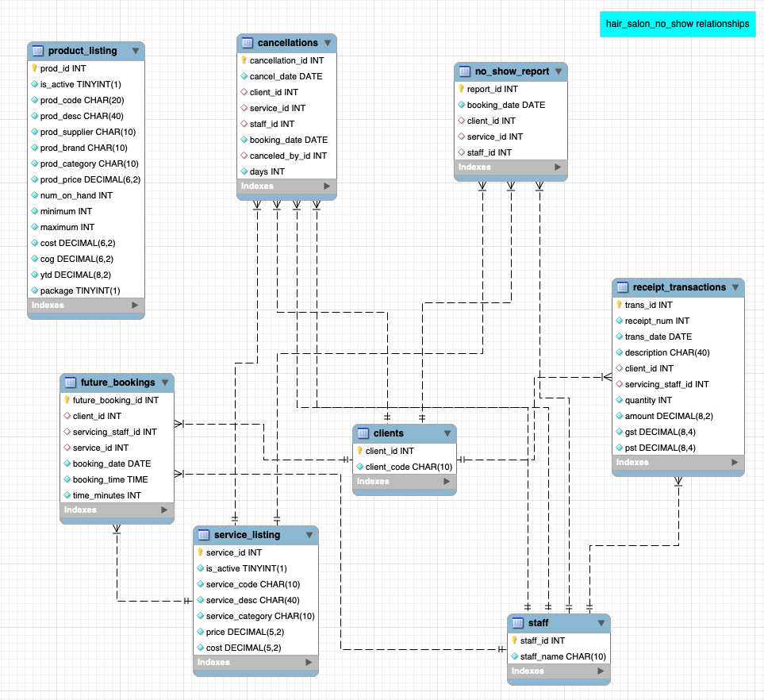

```{r setup, include=FALSE}
knitr::opts_chunk$set(echo = FALSE)
```

```{r packages, message=FALSE}
# check if package is installed and then load package for use
source("R_scripts/requirements.R")

# remove null variables created after packages load
rm(kableExtra, plotly, RMySQL, tidyverse)
```

```{r data_file_names}
# get data file paths
source("R_scripts/data_file_names.R")
```

Welcome
===============================================================================

Row
-----------------------------------------------------------------------

### Project Status

***In-progress***

### Project Description

This project explores insights about no-show appointments at a hair salon.

Row
-----------------------------------------------------------------------

### Notes

* **Source code** for this project can be found on my GitHub repo at [Hair_Salon_No_Show](https://github.com/gconway012/Hair_Salon_No-Show) in the *index.Rmd* file. 

* Small, or reduced, window sizes may cause the top tabs to move to a second line in the header row. This collapses the page contents in a manner that hides various window/section headers, drop-down options, etc. If this occurs,expand or maximize the window to properly view contents. A larger monitor/screen (24" or larger) may be required.

### Project Goals

* Use R/RStudio & MySQL, separately and as integrated tools, to perform analysis.
* Set up a database schema as a simulated business requirement, which includes:
    + Raw data exploration
    + Database table design and relationship identification
    + Raw data extraction and upload into MySQL
* Use flexdashboards in RStudio/RMarkdown as a workflow framework.
* Develop dashboard page(s) 
* Practice other modeling techniques

Row
-----------------------------------------------------------------------

### Software Utilized

* Mac OSx Catalina 
* R 
* RStudio 
* MySQL Community Server 
* MySQL Workbench 
* Microsoft VS Code 
* Microsoft Excel 

<br>

Refer to *README.md* for the list of each software version used for this project.


### Analysis Goals

***TBD***


About {data-navmenu="Pre-DB Explore"}
===============================================================================

### About Pre-DB Exploration

* The information contained on each page under the **Pre-DB Explore** tab was used to gather information used for a MySQL database design and corresponding table creation.

<br>

* This information helped:
  + identify what tables to create
  + determine how each table could/would link to one another
  + determine their respective primary & foreign keys


Client Cancellations {data-navmenu="Pre-DB Explore"}
===============================================================================

```{r read_client_cancel}
cc <- read_csv(datafilepaths[1])
```

Row
-------------------------------------------------------------------------------

### data file

**Client Cancellations**

### data dimensions
```{r cc_dim}
t(as.data.frame(dim(cc), row.names = c("nrow", "ncol"))) %>%
  magrittr::set_rownames(value = "") %>%
  kable(format = "html", escape = F) %>%
  kable_styling(bootstrap_options = "striped", full_width = F,
                position = "left")
```

Row
-------------------------------------------------------------------------------

### column classes/data types 
```{r cc_col_classes}
as.data.frame(sapply(cc, class), stringsAsFactors = F) %>%
                rownames_to_column() %>%
                mutate(class_type = `sapply(cc, class)`) %>%
                column_to_rownames(var = "rowname") %>%
                select(class_type) %>%
                kable(format = "html", escape = F) %>%
                kable_styling(bootstrap_options = "striped", full_width = F, 
                              position = "left")
```


### data sample
```{r cc_head}
head(cc, 5) %>%
                kable(format = "html", escape = F) %>%
                kable_styling(bootstrap_options = "striped", full_width = F, 
                              position = "left")
```

Row
-------------------------------------------------------------------------------

### max column width (in characters) 
```{r cc_max_col_width}
as.data.frame(sapply(cc, function(x){max(nchar(x, keepNA = F))})) %>%
                rownames_to_column() %>%
                mutate(max_num_char = `sapply(cc, function(x) {     max(nchar(x, keepNA = F)) })`) %>%
                column_to_rownames(var = "rowname") %>%
                select(max_num_char) %>%
                kable(format = "html", escape = F) %>%
                kable_styling(bootstrap_options = "striped", full_width = F, 
                              position = "left")
```

### missing/null values index number
```{r cc_missing}
as.data.frame(t(sapply(cc, function(x){which(is.na(x))}))) %>%
                kable(format = "html", escape = F) %>%
                kable_styling(bootstrap_options = "striped", full_width = F, 
                              position = "left")


```


Row
-------------------------------------------------------------------------------

### unique Code values {data-width=300}
```{r cc_unique_Code}
matrix(lapply(cc,
              function(x){sort(unique(x),
                               decreasing = F, na.last = T)})[[2]],
       nrow = 10, ncol = 5) %>%
  kable(format = "html", escape = F) %>%
  kable_styling(bootstrap_options = "striped", full_width = F,
                position = "left")
```

### unique Service values {data-width=300}
```{r cc_unique_Service}
matrix(c(unlist(lapply(cc,
                       function(x){sort(unique(x), decreasing = F,
                                        na.last = T)})[[3]]),
         "-place_holder-"), nrow = 6, ncol = 4) %>%
  kable(format = "html", escape = F) %>%
  kable_styling(bootstrap_options = "striped", full_width = F,
                position = "left")
```


### unique Staff values {data-width=200}
```{r cc_unique_Staff}
matrix(unlist(lapply(cc,
                     function(x){sort(unique(x), decreasing = F,
                                      na.last = T)})[[4]]),
       nrow = 2, ncol = 3) %>%
  kable(format = "html", escape = F) %>%
  kable_styling(bootstrap_options = "striped", full_width = F,
                position = "left")
```

### unique Cancelled By values {data-width=200}
```{r cc_unique_CanceledBy}
matrix(c(unlist(lapply(cc,
                       function(x){sort(unique(x), decreasing = F,
                                        na.last = T)})[[6]]),
         rep("-place_holder-", times = 2)), nrow = 3, ncol = 3) %>%
  kable(format = "html", escape = F) %>%
  kable_styling(bootstrap_options = "striped", full_width = F,
                position = "left")
```

```{r clear_cc_var}
rm(cc)
```


Future Bookings {data-navmenu="Pre-DB Explore"}
===============================================================================

```{r read_future_bookings}
fb <- read_csv(datafilepaths[2],
               col_types = cols(Code = col_character(),
                             Staff = col_character(),
                             Service = col_character(),
                             Date = col_character(),
                             Time = col_character(),
                             TimeInt = col_double())
               )
```

Row
-------------------------------------------------------------------------------

### data file

**Future Bookings**

### data dimensions
```{r fb_dim}
t(as.data.frame(dim(fb), row.names = c("nrow", "ncol"))) %>%
  magrittr::set_rownames(value = "") %>%
  kable(format = "html", escape = F) %>%
  kable_styling(bootstrap_options = "striped", full_width = F,
                position = "left")
```

Row
-------------------------------------------------------------------------------

### column classes/data types
```{r fb_col_classes}
as.data.frame(sapply(fb, class), stringsAsFactors = F) %>%
    rownames_to_column() %>%
    mutate(class_type = `sapply(fb, class)`) %>%
    column_to_rownames(var = "rowname") %>%
    select(class_type) %>%
    kable(format = "html", escape = F) %>%
    kable_styling(bootstrap_options = "striped", full_width = F, 
                  position = "left")
```


### data sample
```{r fb_head}
head(fb, 5) %>%
    kable(format = "html", escape = F) %>%
    kable_styling(bootstrap_options = "striped", full_width = F, 
                  position = "left")
```

Row
-------------------------------------------------------------------------------

### max column width (in characters)
```{r fb_max_col_width}
as.data.frame(sapply(fb, function(x){max(nchar(x, keepNA = F))})) %>%
    rownames_to_column() %>%
    mutate(max_num_char = `sapply(fb, function(x) {     max(nchar(x, keepNA = F)) })`) %>%
    column_to_rownames(var = "rowname") %>%
    select(max_num_char) %>%
    kable(format = "html", escape = F) %>%
    kable_styling(bootstrap_options = "striped", full_width = F, 
                  position = "left")
```

### missing/null values index number
```{r fb_missing, fig.height=8.5}
as.data.frame(t(sapply(fb, function(x){which(is.na(x))}))) %>%
                kable(format = "html", escape = F) %>%
                kable_styling(bootstrap_options = "striped", full_width = F, 
                              position = "left")
```

Row
-------------------------------------------------------------------------------

### unique Staff values
```{r fb_unique_staff, fig.height=2}
t(matrix(lapply(fb, function(x){sort(unique(x), 
                                     decreasing = F, 
                                     na.last = T)})[[2]],
       nrow = 1, ncol = 7)) %>%
  kable(format = "html", escape = F) %>%
  kable_styling(bootstrap_options = "striped", full_width = F, 
                              position = "left")
```

### unique Service values
```{r unique_Service_fb, fig.height=2}
matrix(c(unlist(lapply(fb, function(x){sort(unique(x), 
                                     decreasing = F, 
                                     na.last = T)})[[3]]), "-place_holder-"),
       nrow = 6, ncol = 5) %>%
  kable(format = "html", escape = F) %>%
  kable_styling(bootstrap_options = "striped", full_width = F, 
                              position = "left")
```

Row
-------------------------------------------------------------------------------

### unique Code values
```{r fb_unique_Code}
matrix(c(unlist(lapply(fb, function(x){sort(unique(x), 
                                     decreasing = F, 
                                     na.last = T)})[[1]]), 
  rep("-place_holder", times = 5)),
       nrow = 50, ncol = 16) %>%
  kable(format = "html", escape = F) %>%
  kable_styling(bootstrap_options = "striped", full_width = F,
                position = "left")
```


```{r clear_fb_var}
rm(fb)
```

No_Show Report {data-navmenu="Pre-DB Explore"}
===============================================================================

```{r read_no_show}
ns <- read_csv(datafilepaths[3])
```

Row
-------------------------------------------------------------------------------

### data file

**No_Show Report**

### data dimensions
```{r ns_dim}
t(as.data.frame(dim(ns), row.names = c("nrow", "ncol"))) %>%
  magrittr::set_rownames(value = "") %>%
  kable(format = "html", escape = F) %>%
  kable_styling(bootstrap_options = "striped", full_width = F,
                position = "left")
```

Row
-------------------------------------------------------------------------------

### column classes/data types
```{r ns_col_classes}
as.data.frame(sapply(ns, class), stringsAsFactors = F) %>%
    rownames_to_column() %>%
    mutate(class_type = `sapply(ns, class)`) %>%
    column_to_rownames(var = "rowname") %>%
    select(class_type) %>%
    kable(format = "html", escape = F) %>%
    kable_styling(bootstrap_options = "striped", full_width = F, 
                  position = "left")
```

### data sample
```{r ns_head}
head(ns, 5) %>%
    kable(format = "html", escape = F) %>%
    kable_styling(bootstrap_options = "striped", full_width = F, 
                  position = "left")
```

Row
-------------------------------------------------------------------------------

### max column width (in characters)
```{r ns_max_col_width}
as.data.frame(sapply(ns, function(x){max(nchar(x, keepNA = F))})) %>%
    rownames_to_column() %>%
    mutate(max_num_char = `sapply(ns, function(x) {     max(nchar(x, keepNA = F)) })`) %>%
    column_to_rownames(var = "rowname") %>%
    select(max_num_char) %>%
    kable(format = "html", escape = F) %>%
    kable_styling(bootstrap_options = "striped", full_width = F, 
                  position = "left")
```

### missing/null values index number
```{r ns_missing}
as.data.frame(t(sapply(ns, function(x){which(is.na(x))}))) %>%
                kable(format = "html", escape = F) %>%
                kable_styling(bootstrap_options = "striped", full_width = F, 
                              position = "left")
```

Row
-------------------------------------------------------------------------------

### unique Code values
```{r unique_Code_ns}
matrix(unlist(lapply(ns, function(x){sort(unique(x), 
                                     decreasing = F, 
                                     na.last = T)})[[2]]),
       nrow = 5, ncol = 10) %>%
  kable(format = "html", escape = F) %>%
  kable_styling(bootstrap_options = "striped", full_width = F,
                position = "left")
```

### unique Service values
```{r unique_Description_ns}
matrix(c(unlist(lapply(ns, 
                       function(x){sort(unique(x), 
                                        decreasing = F, na.last = T)})[[3]]), 
         rep("-place_holder-", times = 4)), 
       nrow = 5, ncol = 3) %>%
  kable(format = "html", escape = F) %>%
  kable_styling(bootstrap_options = "striped", full_width = F,
                position = "left")
```

### unique Staff values
```{r unique_Category_ns}
matrix(unlist(lapply(ns, 
                     function(x){sort(unique(x), decreasing = F, 
                                      na.last = T)})[[4]]), 
       nrow = 3, ncol = 2) %>%
  kable(format = "html", escape = F) %>%
  kable_styling(bootstrap_options = "striped", full_width = F,
                position = "left")
```

```{r clear_ns_var}
rm(ns)
```

Product Listing-Retail {data-navmenu="Pre-DB Explore"}
===============================================================================

```{r read_product_listing_retail}
plr <- read_csv(datafilepaths[4])
```

Row
-------------------------------------------------------------------------------

### data file

**Product Listing-Retail**

### data dimensions
```{r plr_dim}
t(as.data.frame(dim(plr), row.names = c("nrow", "ncol"))) %>%
  magrittr::set_rownames(value = "") %>%
  kable(format = "html", escape = F) %>%
  kable_styling(bootstrap_options = "striped", full_width = F,
                position = "left")
```

Row
-------------------------------------------------------------------------------

### column classes/data types {data-width=150}
```{r plr_col_classes}
as.data.frame(sapply(plr, class), stringsAsFactors = F) %>%
    rownames_to_column() %>%
    mutate(class_type = `sapply(plr, class)`) %>%
    column_to_rownames(var = "rowname") %>%
    select(class_type) %>%
    kable(format = "html", escape = F) %>%
    kable_styling(bootstrap_options = "striped", full_width = F, 
                  position = "left")
```

### data sample
```{r plr_head}
head(plr, 5) %>%
    kable(format = "html", escape = F) %>%
    kable_styling(bootstrap_options = "striped", full_width = F, 
                  position = "left")
```

Row
-------------------------------------------------------------------------------

### max column width (in characters) {data-width=150}
```{r plr_max_col_width}
as.data.frame(sapply(plr, function(x){max(nchar(x, keepNA = F))})) %>%
    rownames_to_column() %>%
    mutate(max_num_char = `sapply(plr, function(x) {     max(nchar(x, keepNA = F)) })`) %>%
    column_to_rownames(var = "rowname") %>%
    select(max_num_char) %>%
    kable(format = "html", escape = F) %>%
    kable_styling(bootstrap_options = "striped", full_width = F, 
                  position = "left")
```

### missing/null values index number
```{r plr_missing}
# get info
missinglist <- sapply(plr, function(x){which(is.na(x))})

# format results
tempdf <- as.data.frame(matrix(nrow = 3, 
                               ncol = 14, 
                               dimnames = list(c("", "",""), 
                                               c(names(missinglist)))))

# loop assignments not working right 
# -- had to do direct assignments to cols for display  purposes
tempdf[, 1] <- missinglist[[1]]
tempdf[, 2] <- missinglist[[2]]
tempdf[, 3] <- c(missinglist[[3]], NA, NA)
tempdf[, 4] <- missinglist[[4]]
tempdf[, 5] <- missinglist[[5]]
tempdf[, 6] <- c(missinglist[[6]], NA)
tempdf[, 7] <- missinglist[[7]]
tempdf[, 8] <- missinglist[[8]]
tempdf[, 9] <- missinglist[[9]]
tempdf[, 10] <- missinglist[[10]]
tempdf[, 11] <- missinglist[[11]]
tempdf[, 12] <- missinglist[[12]]
tempdf[, 13] <- missinglist[[13]]
tempdf[, 14] <- missinglist[[14]]

# remove row names
rownames(tempdf) <- NULL

# make all cols character class & remove NAs
tempdf <- sapply(tempdf, as.character)

tempdf[which(is.na(tempdf))] <- ""

# show the info
tempdf %>%
    kable(format = "html", escape = F) %>%
    kable_styling(bootstrap_options = "striped", full_width = F, 
                  position = "left")

# clear temp variables
rm(missinglist, tempdf)
```

Row
-------------------------------------------------------------------------------

### unique Supplier values {data-width=200}
```{r unique_Supplier_plr}
matrix(lapply(plr, 
              function(x){sort(unique(x), 
                               decreasing = F, na.last = T)})[[4]]) %>%
    kable(format = "html", escape = F) %>%
    kable_styling(bootstrap_options = "striped", full_width = F, 
                  position = "left")
```

### unique Brand values {data-width=300}
```{r unique_Brand_plr, fig.height=2}
matrix(c(lapply(plr, 
                 function(x){sort(unique(x), decreasing = F, 
                                  na.last = T)})[[5]], 
         rep("-place_holder", times = 2)),
         nrow = 3, ncol = 3) %>%
    kable(format = "html", escape = F) %>%
    kable_styling(bootstrap_options = "striped", full_width = F, 
                  position = "left")
```

### unique Category values {data-width=200}
```{r unique_Category_plr, fig.height=2}
matrix(sapply(plr, 
              function(x){sort(unique(x), decreasing = F, 
                               na.last = T)})[[6]]) %>%
    kable(format = "html", escape = F) %>%
    kable_styling(bootstrap_options = "striped", full_width = F, 
                  position = "left")
```

Row
-------------------------------------------------------------------------------

### unique Code values
```{r unique_Code_plr, fig.height=4.5}
matrix(c(unlist(lapply(plr, function(x){sort(unique(x), decreasing = F, na.last = T)})[[2]]),
         rep("-place_holder-", times = 9)), 
       nrow = 11, ncol = 10) %>%
    kable(format = "html", escape = F) %>%
    kable_styling(bootstrap_options = "striped", full_width = F, 
                  position = "left")
```

Row
-------------------------------------------------------------------------------

### unique Description values
```{r unique_Description_plr}
matrix(c(unlist(lapply(plr, 
                       function(x){sort(unique(x), decreasing = F, 
                                        na.last = T)})[[3]]),
         rep("-place_holder-", times = 9)), 
       nrow = 11, ncol = 10) %>%
    kable(format = "html", escape = F) %>%
    kable_styling(bootstrap_options = "striped", full_width = F, 
                  position = "left")
```


```{r clear_plr_var}
rm(plr)
```

Receipt Transactions {data-navmenu="Pre-DB Explore"}
===============================================================================

```{r read_receipt_trans}
rt <- read_csv(datafilepaths[5])
```

Row
-------------------------------------------------------------------------------

### data file

**Receipt Transactions**

### data dimensions
```{r rt_dim, fig.height=2}
t(as.data.frame(dim(rt), row.names = c("nrow", "ncol"))) %>%
  magrittr::set_rownames(value = "") %>%
  kable(format = "html", escape = F) %>%
  kable_styling(bootstrap_options = "striped", full_width = F,
                position = "left")
```

Row
-------------------------------------------------------------------------------

### column classes/data types {data-width=350}
```{r rt_col_classes}
as.data.frame(sapply(rt, class), stringsAsFactors = F) %>%
    rownames_to_column() %>%
    mutate(class_type = `sapply(rt, class)`) %>%
    column_to_rownames(var = "rowname") %>%
    select(class_type) %>%
    kable(format = "html", escape = F) %>%
    kable_styling(bootstrap_options = "striped", full_width = F, 
                  position = "left")
```

### data sample
```{r rt_head}
head(rt, 5) %>%
    kable(format = "html", escape = F) %>%
    kable_styling(bootstrap_options = "striped", full_width = F, 
                  position = "left")
```


Row
-------------------------------------------------------------------------------

### max column width (in characters) {data-width=200}
```{r rt_max_col_width}
as.data.frame(sapply(rt, function(x){max(nchar(x, keepNA = F))})) %>%
    rownames_to_column() %>%
    mutate(max_num_char = `sapply(rt, function(x) {     max(nchar(x, keepNA = F)) })`) %>%
    column_to_rownames(var = "rowname") %>%
    select(max_num_char) %>%
    kable(format = "html", escape = F) %>%
    kable_styling(bootstrap_options = "striped", full_width = F, 
                  position = "left")
```

### missing/null values index number {data-width=500}
```{r rt_missing}
# get info
missinglist <- sapply(rt, function(x){which(is.na(x))})

# format results
tempdf <- as.data.frame(matrix(nrow = 3, 
                               ncol = 9, 
                               dimnames = list(c("", "",""), 
                                               c(names(missinglist)))))

# loop assignments not working right 
# -- had to do direct assignments to cols for display  purposes
tempdf[, 1] <- missinglist[[1]]
tempdf[, 2] <- missinglist[[2]]
tempdf[, 3] <- missinglist[[3]]
tempdf[, 4] <- missinglist[[4]]
tempdf[, 5] <- missinglist[[5]]
tempdf[, 6] <- missinglist[[6]]
tempdf[, 7] <- missinglist[[7]]
tempdf[, 8] <- missinglist[[8]]
tempdf[, 9] <- missinglist[[9]]

# remove row names
rownames(tempdf) <- NULL

# make all cols character class & remove NAs
tempdf <- sapply(tempdf, as.character)

tempdf[which(is.na(tempdf))] <- ""

# show the info
tempdf %>%
    kable(format = "html", escape = F) %>%
    kable_styling(bootstrap_options = "striped", full_width = F, 
                  position = "left")

# clear temp variables
rm(missinglist, tempdf)
```

### unique Staff values {data-width=300}
```{r rt_unique_Staff}
matrix(c(lapply(rt, 
         function(x){sort(unique(x), 
                          decreasing = F, 
                          na.last = T)})[[5]],
         rep("-place_holder-", times = 2)),
       nrow = 3, ncol = 3) %>%
    kable(format = "html", escape = F) %>%
    kable_styling(bootstrap_options = "striped", full_width = F, 
                  position = "left")
```

Column
-------------------------------------------------------------------------------
### unique Client values
```{r rt_unique_Code}
matrix(lapply(rt, 
              function(x){sort(unique(x), 
                               decreasing = F, 
                               na.last = T)})[[4]],
       nrow = 59, ncol = 13) %>%
    kable(format = "html", escape = F) %>%
    kable_styling(bootstrap_options = "striped", full_width = F, 
                  position = "left")
```


```{r clear_rt_var}
rm(rt)
```

Service Listing {data-navmenu="Pre-DB Explore"}
===============================================================================

```{r read_service_listing}
sl <- read_csv(datafilepaths[6])
```

Row
-------------------------------------------------------------------------------

### data file

**Service Listing**

### data dimensions
```{r sl_dim}
t(as.data.frame(dim(sl), row.names = c("nrow", "ncol"))) %>%
  magrittr::set_rownames(value = "") %>%
  kable(format = "html", escape = F) %>%
  kable_styling(bootstrap_options = "striped", full_width = F,
                position = "left")
```

Row
-------------------------------------------------------------------------------

### column classes/data types
```{r sl_col_classes}
as.data.frame(sapply(sl, class), stringsAsFactors = F) %>%
    rownames_to_column() %>%
    mutate(class_type = `sapply(sl, class)`) %>%
    column_to_rownames(var = "rowname") %>%
    select(class_type) %>%
    kable(format = "html", escape = F) %>%
    kable_styling(bootstrap_options = "striped", full_width = F, 
                  position = "left")
```

### data sample
```{r sl_head}
head(sl, 5) %>%
    kable(format = "html", escape = F) %>%
    kable_styling(bootstrap_options = "striped", full_width = F, 
                  position = "left")
```

Row
-------------------------------------------------------------------------------

### max column width (in characters)
```{r sl_max_col_width}
as.data.frame(sapply(sl, function(x){max(nchar(x, keepNA = F))})) %>%
    rownames_to_column() %>%
    mutate(max_num_char = `sapply(sl, function(x) {     max(nchar(x, keepNA = F)) })`) %>%
    column_to_rownames(var = "rowname") %>%
    select(max_num_char) %>%
    kable(format = "html", escape = F) %>%
    kable_styling(bootstrap_options = "striped", full_width = F, 
                  position = "left")
```

### missing/null values index number
```{r sl_missing}
as.data.frame(t(sapply(sl, function(x){which(is.na(x))}))) %>%
                kable(format = "html", escape = F) %>%
                kable_styling(bootstrap_options = "striped", full_width = F, 
                              position = "left")
```

### unique Category values
```{r unique_Category_sl}
matrix(unlist(sapply(sl, 
                     function(x){sort(unique(x), 
                                      decreasing = F, 
                                      na.last = T)})[[4]])) %>%
  kable(format = "html", escape = F) %>%
  kable_styling(bootstrap_options = "striped", full_width = F,
                position = "left")
```

Row
-------------------------------------------------------------------------------
### unique Code values
```{r sl_unique_Code}
matrix(unlist(lapply(sl, 
                     function(x){sort(unique(x), 
                                      decreasing = F, 
                                      na.last = T)})[[2]]), 
       nrow = 3, ncol = 11) %>%
  kable(format = "html", escape = F) %>%
  kable_styling(bootstrap_options = "striped", full_width = F,
                position = "left")
```

Row
-------------------------------------------------------------------------------

### unique Description values
```{r sl_unique_Description}
matrix(unlist(lapply(sl, 
                     function(x){sort(unique(x), 
                                      decreasing = F, 
                                      na.last = T)})[[3]]), 
       nrow = 3, ncol = 11) %>%
  kable(format = "html", escape = F) %>%
  kable_styling(bootstrap_options = "striped", full_width = F,
                position = "left")
```


```{r clear_sl_var}
rm(sl)
```

Starting Data Tables/Files {data-navmenu="DB Creation"}
===============================================================================

### Raw Data Table Names and Columns

```{r pull_name_and_cols}
# initialize empty vector and list
tablename <- vector(length = length(datafilenames))

tablecols <- vector(mode = "list", length = length(datafilenames))


# get table names and column headings
for (i in 1:length(datafilepaths)){
    
    # extract table name from filename
    tablename[i] <- str_split(datafilenames[i], ".csv") %>%
        unlist() %>%
        .[1]
    
    # temp hold of column names in list
    tablecols[[i]] <- read_csv(datafilepaths[i], n_max = 1) %>%
        names()
    
    rm(i)
}

# create empty dataframe
tempdf <- as.data.frame(matrix(nrow = 14, ncol = 6))

# fill dataframe
names(tempdf) <- tablename

for (i in 1:ncol(tempdf)){
    
    ntimes <- nrow(tempdf) - length(tablecols[[i]])
    
    tempdf[i] <- c(tablecols[[i]], rep("---", times = ntimes))
    
    rm(i, ntimes)
    
}

rm (tablename, tablecols)

# display table names and columns in chart
tempdf %>%
    kable(format = "html", escape = F) %>%
    kable_styling(bootstrap_options = "striped", full_width = F, 
                  position = "left")

# clean memory
rm (tempdf)
```


DB Structure After Redesign {data-navmenu="DB Creation"}
===============================================================================

Row 
-------------------------------------------------------------------------------




Data Dictionary Notes{data-navmenu="DB Creation"}
===============================================================================

* Column headings were renamed in MySQL tables for clarity.

* While reviewing table data during database construction, certain column calculations were identified. The select calculations identified are as follows:

<br>

| SQL Table | Column | Notes/Meaning |
| :--- | :--- | :--- |
| product_listing | COG | calculated as $COG = num\_on\_hand * cost$; COG definition/meaning is unknown |
| retail_transactions | GST | calculated as $GST = Amount * 0.05$; GST assumed to mean "Govt. Sales Tax" |
| retail_transactions | PST | calculated as $PST = Amount * 0.08$; PST assumed to mean "Provincial Sales Tax" |

Sales/Revenue {data-navmenu="Dashboards"}
===============================================================================

```{r database_connect}
source("connect_db.R")
```

```{r source_sales_queries}
source("R_scripts/sales_queries.R")
```

Row
-------------------------------------------------------------------------------

### Date Range (Receipt Transactions)

```{r receipts_date_range}
sales_query("date_range_receipts") %>%
  kable(format = "html", escape = F) %>%
    kable_styling(bootstrap_options = "striped", full_width = F, 
                  position = "left")
```


### Total Sales

```{r total_sales}
flexdashboard::valueBox(sales_query("total_sales"),
                        icon = "fa-usd",
                        color = "lightgreen")
```


### Total Sales (Services)

```{r total_services_sales}
flexdashboard::valueBox(sales_query("total_services_sales"),
                        icon = "fa-usd",
                        color = "lightblue")
```


### Total Sales (Products)

```{r total_product_sales}
flexdashboard::valueBox(sales_query("total_products_sales"),
                        icon = "fa-usd",
                        color = "#ffaf87")
```


### Total Sales (MISC - Service and/or Product)

```{r misc_sales}
flexdashboard::valueBox(sales_query("misc_sales"),
                        icon = "fa-usd",
                        color = "#ffffd7")
```

Row
-------------------------------------------------------------------------------

### # Services Offered (Active)

```{r num_services_offered}
flexdashboard::valueBox(sales_query("num_services_offered"),
                        icon = "fa-group",
                        color = "LightSteelBlue")
```


### # Products Offered (Active)

```{r num_products_offered}
flexdashboard::valueBox(sales_query("num_products_offered"),
                        icon = "fa-cubes",
                        color = "LightSteelBlue")
```

Row
-------------------------------------------------------------------------------

### # Products Out-of-Stock (Active)

```{r products_out_of_stock}
sales_query("products_oos") %>%
  kable(format = "html", escape = F) %>%
    kable_styling(bootstrap_options = "striped", full_width = F, 
                  position = "left")
```

Row
-------------------------------------------------------------------------------

### Top 10 Services

```{r top_ten_services}
sales_query("top_ten_services") %>%
  kable(format = "html", escape = F) %>%
    kable_styling(bootstrap_options = "striped", full_width = F, 
                  position = "left")
```


### Top 10 Products

```{r top_ten_products}
sales_query("top_ten_products") %>%
  kable(format = "html", escape = F) %>%
    kable_styling(bootstrap_options = "striped", full_width = F, 
                  position = "left")
```


Row
-------------------------------------------------------------------------------

### Bottom 5 Services

```{r bottom_five_services}
sales_query("bottom_five_services") %>%
  kable(format = "html", escape = F) %>%
    kable_styling(bootstrap_options = "striped", full_width = F, 
                  position = "left")
```


### Bottom 5 Products

```{r bottom_five_products}
sales_query("bottom_five_products") %>%
  kable(format = "html", escape = F) %>%
    kable_styling(bootstrap_options = "striped", full_width = F, 
                  position = "left")
```


Row
-------------------------------------------------------------------------------

### Daily Sales

```{r daily_sales_plot}
sales_query("daily_sales")
```

Row
-------------------------------------------------------------------------------

### Sales by Week

```{r sales_by_week}
sales_query("sales_by_week")
```

Row
-------------------------------------------------------------------------------

### Daily Sales by Day-of-the-Week (DOW)

```{r daily_sales_by_DOW_plot}
sales_query("daily_sales_isolated_DOW")
```


Row
-------------------------------------------------------------------------------

### Total Sales Aggregated by (DOW)

```{r DOW_sales_aggregated}
sales_query("DOW_sales_aggregated")
```


Clients {data-navmenu="Dashboards"}
===============================================================================

```{r source_client_queries}
source("R_scripts/client_queries.R")
```

Row
-------------------------------------------------------------------------------

### Date Range - Receipts

```{r receipts_date_range2}
sales_query("date_range_receipts") %>%
  kable(format = "html", escape = F) %>%
    kable_styling(bootstrap_options = "striped", full_width = F,
                  position = "left")
```

### Date Range - Cancellations

```{r cancellations_date_range}
clients_query("date_range_cancellations") %>%
  kable(format = "html", escape = F) %>%
    kable_styling(bootstrap_options = "striped", full_width = F, 
                  position = "left")
```


Row
-------------------------------------------------------------------------------

### Date Range - No-Show Report

```{r noshow_date_range}
clients_query("date_range_noshow_report") %>%
  kable(format = "html", escape = F) %>%
    kable_styling(bootstrap_options = "striped", full_width = F, 
                  position = "left")
```


### Date Range - Future Bookings

```{r future_bookings_date_range}
clients_query("date_range_future_bookings") %>%
  kable(format = "html", escape = F) %>%
    kable_styling(bootstrap_options = "striped", full_width = F, 
                  position = "left")
```


Row
-------------------------------------------------------------------------------

### Total Clients (in records)

```{r total_clients}
flexdashboard::valueBox(clients_query("total_clients_in_records"),
                        icon = "fa-group")
```


### Total Walk-ins (on receipts)

```{r total_walkins}
flexdashboard::valueBox(clients_query("total_walkins_on_receipts"),
                        icon = "fa-group")
```


Row
-------------------------------------------------------------------------------

### Clients (on records, on receipts, excludes walk-ins)

```{r clients_on_receipts}
flexdashboard::valueBox(clients_query("total_clients_on_receipts_excl_walkins"),
                        icon = "fa-group")
```


### Repeat Clients (> 1 visit, on receipts, excludes walk-ins)

```{r repeat_clients}
flexdashboard::valueBox(clients_query("total_repeat_clients_on_receipts_excl_walkins"),
                        icon = "fa-group")
```


### One-time Clients (on-receipts, excludes walk-ins)

```{r onetime_clients}
flexdashboard::valueBox(clients_query("total_onetime_clients_on_receipts_excl_walkins"),
                        icon = "fa-group")
```


Row
-------------------------------------------------------------------------------

### 10 Most Frequent Clients (excludes walk-ins)

```{r frequent_clients_table}
clients_query("most_freq_clients_excl_walkins") %>%
  DT::datatable(filter = "top",
                options = list(autoWidth = T,
                               pageLength = 10,
                               autoHideNavigation = F,
                               dom = "Bfrtip",
                               searchHighlight = T
                               )
                )
```


Row
-------------------------------------------------------------------------------

### Clients w/ Most Cancellations

```{r most_cancellations}
clients_query("clients_most_cancellations")
```

Staff {data-navmenu="Dashboards"}
===============================================================================

```{r source_staff_queries}
source("R_scripts/staff_queries.R")
```

Row
-------------------------------------------------------------------------------

### Date Range - Receipts

```{r receipts_date_range3}
sales_query("date_range_receipts") %>%
  kable(format = "html", escape = F) %>%
    kable_styling(bootstrap_options = "striped", full_width = F,
                  position = "left")
```

Row
-------------------------------------------------------------------------------

### Earnings by Staff

```{r earnings_by_staff}
staff_query("earnings_by_staff")
```


Row
-------------------------------------------------------------------------------

### Appointments by Staff (excludes Walk-Ins)

```{r appointments_by_staff}
staff_query("appointments_by_staff")
```


Row
-------------------------------------------------------------------------------

### Cancellations by Staff

```{r cancellations_by_staff}
staff_query("cancellations_by_staff")
```

Walk-Ins Report {data-navmenu="Reports"}
===============================================================================

### Walk-Ins Report

```{r walkins_report}
source("R_scripts/WalkIns_report.R")

walkins_query("walkins_report") %>%
  kable(format = "html", escape = F) %>%
  kable_styling(bootstrap_options = "striped", full_width = F,
                position = "left")
```

Cancellations Report {data-navmenu="Reports"}
===============================================================================

### Cancellations Report

```{r cancellations_report}
source("R_scripts/cancellation_report.R")

cancellations_query("cancellations_report") %>%
  kable(format = "html", escape = F) %>%
  kable_styling(bootstrap_options = "striped", full_width = F,
                position = "left")
```

